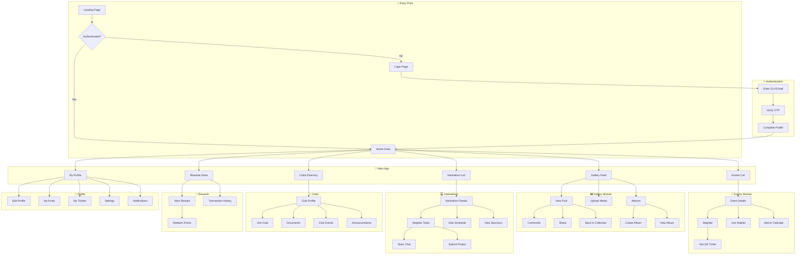
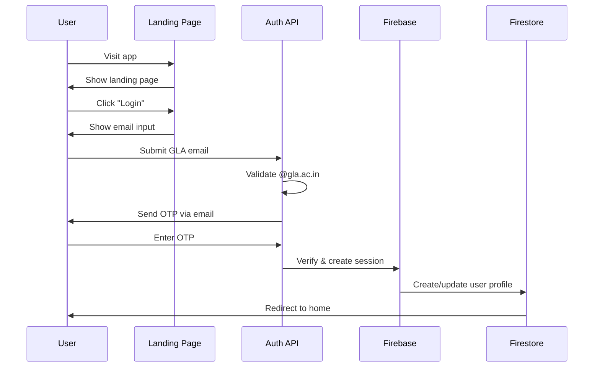
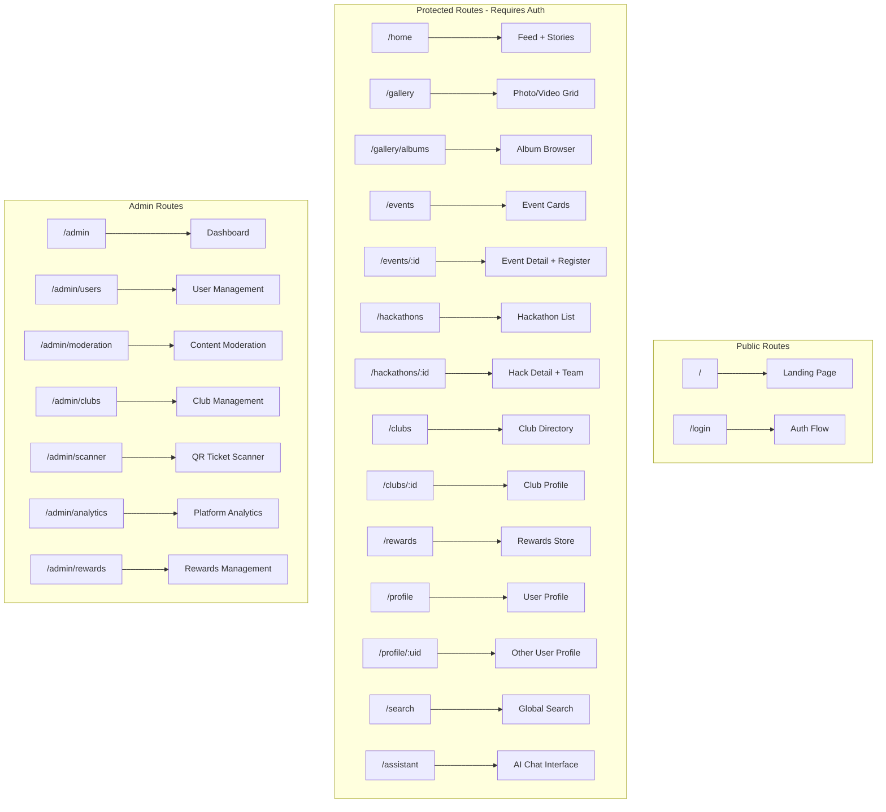
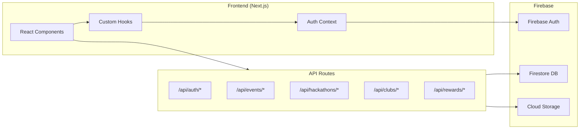

# 🎨 GLA Gallery - App Wireframe Workflow

## Overview
GLA Gallery is a campus community platform for CampusHub students featuring photo sharing, event management, hackathons, clubs, and rewards.

---

## 🌐 Application Flow Diagram



---

## 🔐 Authentication Flow



---

## 📱 Screen Hierarchy



---

## 🎯 Core User Journeys

### Journey 1: New User Onboarding
```
Landing Page → Login → Enter GLA Email → Verify OTP → Setup Profile → Home Feed
```

### Journey 2: Post Upload
```
Home → Upload Button → Select Media → Add Caption/Tags → Choose Visibility → Publish → View in Feed
```

### Journey 3: Event Registration
```
Events → Browse Events → View Details → Click Register → Confirm → Receive QR Ticket → Add to Calendar
```

### Journey 4: Hackathon Participation
```
Hackathons → View Details → Create Team → Invite Members → Build Project → Submit → View Leaderboard
```

### Journey 5: Club Engagement
```
Clubs → Search Club → View Profile → Join → Access Documents → View Announcements → Attend Events
```

### Journey 6: Redeem Rewards
```
Profile → View Points → Rewards Store → Select Reward → Confirm Redemption → Collect
```

---

## 🏗️ Component Architecture

| Module | Key Components | Data Source |
|--------|---------------|-------------|
| **Auth** | LoginForm, OTPInput, ProfileSetup | Firebase Auth |
| **Gallery** | PostCard, ImageGrid, UploadDialog, AlbumCard | Firestore `posts`, `albums` |
| **Events** | EventCard, RegisterButton, WaitlistButton, QRTicket | Firestore `events`, `tickets` |
| **Hackathons** | HackathonCard, TeamForm, SubmissionForm, Leaderboard | Firestore `hackathons` |
| **Clubs** | ClubCard, ClubDocuments, AnnouncementFeed | Firestore `clubs` |
| **Rewards** | RewardCard, PointsDisplay, RedemptionHistory | Firestore `rewards`, `redemptions` |
| **Admin** | UserTable, ModerationQueue, AlbumsManager, SponsorsEditor | All collections |

---

## 📊 Data Flow



---

## 🎨 Key UI States

| Screen | Empty State | Loading | Error | Success |
|--------|-------------|---------|-------|---------|
| Feed | "No posts yet" | Skeleton grid | Toast error | Posts display |
| Events | "No events" | Skeleton cards | Retry button | Event cards |
| Clubs | "Join a club!" | Loading spinner | Alert | Club list |
| Tickets | "No tickets" | Shimmer effect | Snackbar | QR codes |
| Albums | "Create first album" | Skeleton | Toast | Album grid |

---

*This workflow represents the complete user experience across GLA Gallery.*
